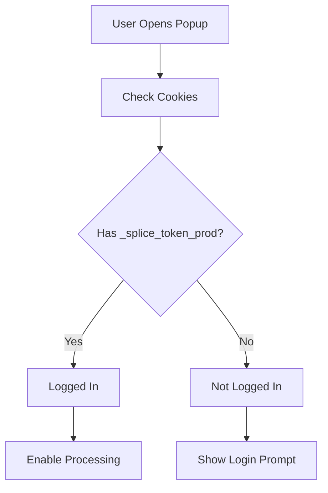
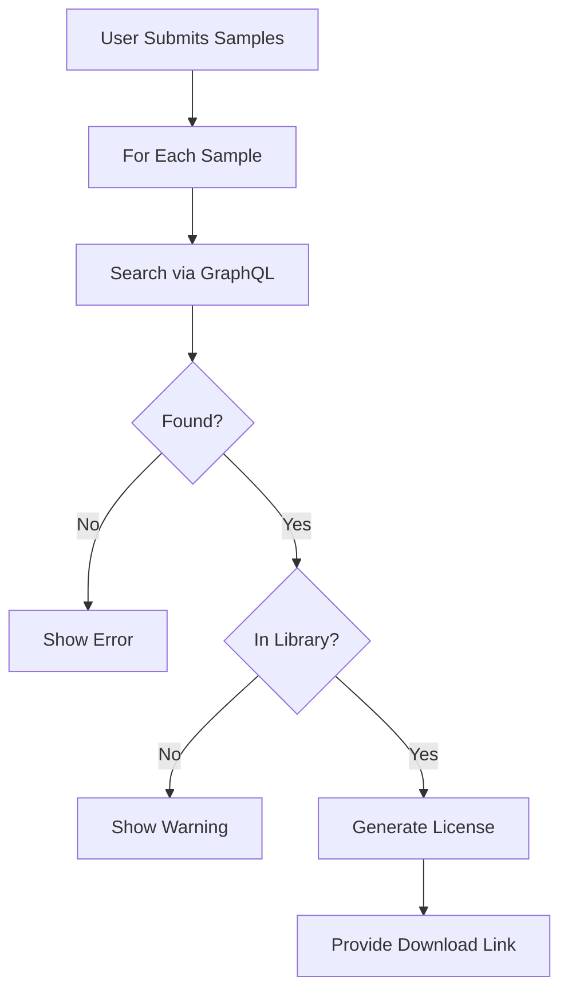

# Splice License Batch Generator

A Chrome extension that automates the process of generating certified licenses for multiple Splice samples at once.


---

## 🎯 Overview

The Splice License Batch Generator streamlines the tedious process of generating licenses for Splice samples. Instead of manually navigating to each sample and generating licenses one by one, this extension allows you to:

- 📝 **Batch Process**: Generate licenses for multiple samples simultaneously
- ⚡ **Fast & Efficient**: Direct API integration for quick processing
- 🔒 **Secure**: Uses your existing Splice login, no credentials stored
- 💾 **Smart**: Remembers your work across sessions
- ✅ **Reliable**: Verifies samples are in your library before generation

---

## ✨ Features

### Core Functionality
- **Batch License Generation**: Process multiple samples at once
- **Automatic Authentication**: Detects your Splice login automatically
- **Library Verification**: Checks if samples are in your library
- **One-Click Downloads**: Download licenses with a single click
- **State Persistence**: Your input and results are saved automatically

### User Experience
- **Clean Interface**: Simple, intuitive popup design
- **Real-Time Feedback**: Progress updates and status indicators
- **Error Handling**: Clear error messages with helpful guidance
- **No Tab Switching**: Popup stays open during processing

### Technical Features
- **GraphQL API Integration**: Direct API calls for speed
- **Cookie-Based Auth**: Reliable login detection
- **Page Context Injection**: Bypass CORS restrictions
- **Background Processing**: Hidden tabs for API operations

---

## 🚀 Quick Start

### Installation

1. **Clone the Repository**
   ```bash
   git clone https://github.com/yourusername/splice-chrome-extension.git
   cd splice-chrome-extension
   ```

2. **Load in Chrome**
   - Open Chrome and go to `chrome://extensions/`
   - Enable "Developer mode" (toggle in top-right)
   - Click "Load unpacked"
   - Select the `splice-chrome-extension` directory

3. **Configure License Info**
   - Click the extension icon
   - Click "Open Settings"
   - Enter your Full Legal Name and Artist Name
   - Click "Save License Information"

### Basic Usage

1. **Log in to Splice**
   - Open [splice.com](https://splice.com) and log in
   - Keep the tab open

2. **Enter Sample Names**
   - Click the extension icon
   - Paste sample names (one per line) in the text area
   - Include the `.wav` extension

3. **Generate Licenses**
   - Click "Process Samples"
   - Wait for processing to complete
   - Click "Download License" for each successful generation

📖 **For detailed instructions, see [USER_GUIDE.md](USER_GUIDE.md)**

---

## 📋 Requirements

- **Browser**: Google Chrome 88 or higher
- **Account**: Active Splice.com account with library samples
- **Network**: Stable internet connection

---

## 🏗️ Project Structure

```
splice-chrome-extension/
├── manifest.json              # Extension configuration
├── background/
│   └── service-worker.js      # Background tasks & API coordination
├── content/
│   ├── content-script.js      # Splice.com page interaction
│   └── page-script.js         # Page context for auth tokens
├── popup/
│   ├── popup.html             # Extension popup interface
│   ├── popup.css              # Popup styling
│   └── popup.js               # Popup logic
├── options/
│   ├── options.html           # Settings page
│   ├── options.css            # Settings styling
│   └── options.js             # Settings logic
├── shared/
│   ├── encryption.js          # Data encryption utilities
│   └── utils.js               # Shared utility functions
└── memory-bank/               # Project documentation
    ├── projectbrief.md        # Project overview
    ├── activeContext.md       # Current work status
    ├── progress.md            # Development progress
    ├── techContext.md         # Technical details
    └── systemPatterns.md      # Architecture patterns
```

---

## 🔧 How It Works

### Architecture

The extension uses a modular architecture with three main components:

1. **Service Worker** (`background/service-worker.js`)
   - Coordinates API requests
   - Manages session detection
   - Handles message passing

2. **Content Script** (`content/content-script.js`)
   - Interacts with Splice.com pages
   - Makes authenticated GraphQL requests
   - Extracts authentication tokens

3. **Popup Interface** (`popup/`)
   - User input and output
   - State management
   - Result display

### Authentication Flow



### License Generation Flow



---

## 🛠️ Development

### Technologies Used

- **Manifest V3**: Modern Chrome extension API
- **Vanilla JavaScript**: No frameworks, lightweight
- **GraphQL**: Direct Splice API integration
- **Chrome APIs**: Storage, Tabs, Cookies, Scripting

### Key Technical Decisions

1. **Cookie-Based Auth**: `_splice_token_prod` is the reliable auth indicator
2. **GraphQL API**: Direct API calls instead of DOM scraping
3. **Page Context Injection**: Accesses localStorage for Bearer tokens
4. **Hidden Tabs**: Background tabs for API operations without disruption

### Debug Mode

To enable detailed logging:

1. Open Chrome DevTools on the popup
2. Check the Console tab
3. Errors and status messages will appear there

---

## 🐛 Troubleshooting

### Common Issues

| Issue | Solution |
|-------|----------|
| "Not logged in" error | Refresh Splice.com tab and reopen popup |
| "Sample not in library" | Add sample to library on Splice.com first |
| "Sample not found" | Verify exact filename with `.wav` extension |
| Extension closes | Keep a Splice.com tab open |

See [USER_GUIDE.md](USER_GUIDE.md) for comprehensive troubleshooting.

---

## 📝 Documentation

- **[USER_GUIDE.md](USER_GUIDE.md)**: Complete user documentation
- **[memory-bank/activeContext.md](memory-bank/activeContext.md)**: Current development status
- **[memory-bank/techContext.md](memory-bank/techContext.md)**: Technical documentation
- **[memory-bank/systemPatterns.md](memory-bank/systemPatterns.md)**: Architecture patterns

---

## 🤝 Contributing

Contributions are welcome! Here's how you can help:

1. **Report Bugs**: Open an issue with details and steps to reproduce
2. **Suggest Features**: Share ideas for improvements
3. **Submit PRs**: Fork, make changes, and submit a pull request
4. **Improve Docs**: Help make documentation clearer

### Development Setup

```bash
# Clone the repo
git clone https://github.com/yourusername/splice-chrome-extension.git

# Load in Chrome
# 1. Go to chrome://extensions/
# 2. Enable Developer mode
# 3. Click "Load unpacked"
# 4. Select the project directory

# Make changes and reload
# Click the reload icon in chrome://extensions/
```

---

## 📊 Project Status

- ✅ **Core Functionality**: Complete
- ✅ **Authentication**: Working
- ✅ **License Generation**: Functional
- ✅ **Error Handling**: Comprehensive
- ✅ **Documentation**: Complete
- 🔄 **Chrome Web Store**: Not yet submitted

---

## 🔒 Privacy & Security

- **No Data Collection**: Extension doesn't collect or transmit user data
- **Local Storage Only**: Settings stored locally in your browser
- **Session Piggybacking**: Uses your existing Splice login
- **No Credentials Stored**: Never stores your Splice username or password
- **Minimal Permissions**: Only requests necessary Chrome permissions

---

## 📜 License

This project is licensed under the MIT License - see the [LICENSE](LICENSE) file for details.

---

## 👤 Author

**Owen Bush**

- GitHub: [@owenbush](https://github.com/owenbush)

---

## 🙏 Acknowledgments

- **Splice.com**: For providing an excellent sample library platform
- **Chrome Extensions Documentation**: For comprehensive API guides
- **GraphQL Community**: For excellent tooling and resources

---

## ⚠️ Disclaimer

This extension is an independent project and is not affiliated with, endorsed by, or associated with Splice.com. Always comply with Splice's Terms of Service when using this tool.

---

## 📞 Support

Having issues? Check these resources:

1. **[USER_GUIDE.md](USER_GUIDE.md)**: Comprehensive user documentation
2. **[Troubleshooting Section](#-troubleshooting)**: Common issues and solutions
3. **[GitHub Issues](https://github.com/yourusername/splice-chrome-extension/issues)**: Report bugs or request features

---

**⭐ If you find this extension helpful, please star the repo!**

*Last updated: October 2025*
